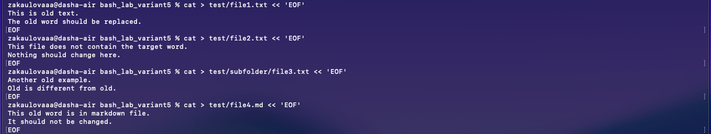
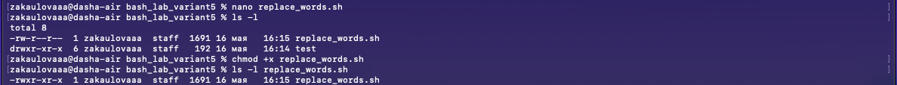
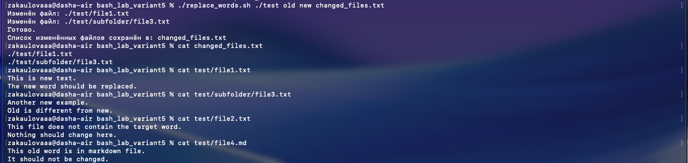

# Отчёт по лабораторной работе

## Тема

**Разработка Bash-скрипта для замены слов в текстовых файлах**

## Вариант

**Вариант 5**

> В текстовых файлах `.txt` заменить одно слово на другое, из найденных файлов составить список, сохранить его в файл.

---

## 1. Цель работы

Целью лабораторной работы является получение практических навыков разработки Bash-скриптов для обработки файловой системы.

В ходе работы необходимо разработать сценарий, который выполняет поиск текстовых файлов с расширением `.txt`, заменяет в них заданное слово на другое и формирует список файлов, в которых была выполнена замена.

---

## 2. Постановка задачи

Согласно варианту 5 необходимо выполнить следующую задачу:

> В текстовых файлах `.txt` заменить одно слово на другое, из найденных файлов составить список, сохранить его в файл.

Для выполнения задания необходимо разработать Bash-скрипт, который:

1. Принимает из командной строки каталог для поиска файлов.
2. Принимает слово, которое необходимо заменить.
3. Принимает слово, на которое необходимо выполнить замену.
4. Принимает имя файла, в который будет сохранён список изменённых файлов.
5. Выполняет поиск всех файлов с расширением `.txt` в указанном каталоге и его подкаталогах.
6. Проверяет наличие заданного слова в каждом найденном файле.
7. Выполняет замену слова только в тех файлах, где оно было найдено.
8. Сохраняет список изменённых файлов в отдельный файл.

---

## 3. Используемое программное обеспечение

Работа выполнялась в операционной системе **macOS** с использованием встроенного приложения **Terminal**.

Используемые средства:

| Средство | Назначение |
|---|---|
| `Terminal` | приложение macOS для работы с командной строкой |
| `bash` | командная оболочка для выполнения скрипта |
| `nano` | текстовый редактор для создания скрипта |
| `find` | поиск файлов в каталоге и подкаталогах |
| `grep` | проверка наличия слова в файле |
| `sed` | замена текста в файле |
| `cat` | создание и просмотр содержимого файлов |
| `chmod` | изменение прав доступа к файлу |
| `mkdir` | создание каталогов |

macOS является Unix-подобной операционной системой, поэтому позволяет выполнять Bash-скрипты и использовать стандартные консольные утилиты. При этом в macOS используется BSD-версия утилиты `sed`, поэтому для редактирования файла на месте используется синтаксис:

```bash
sed -i '' "s/старое_слово/новое_слово/g" file.txt
```

В Linux аналогичная команда обычно выглядит так:

```bash
sed -i "s/старое_слово/новое_слово/g" file.txt
```

---

## 4. Алгоритм решения

Алгоритм работы программы:

1. Получить из командной строки четыре аргумента:
   - каталог для поиска;
   - старое слово;
   - новое слово;
   - имя файла для сохранения списка изменённых файлов.

2. Проверить, что количество переданных аргументов равно четырём.

3. Проверить, что указанный каталог существует.

4. Создать или очистить файл, в который будет записан список изменённых файлов.

5. С помощью команды `find` найти все файлы с расширением `.txt` в указанном каталоге и его подкаталогах.

6. Для каждого найденного файла выполнить проверку наличия старого слова с помощью команды `grep`.

7. Если слово найдено, выполнить замену старого слова на новое с помощью команды `sed`.

8. Добавить путь к изменённому файлу в файл результата.

9. Вывести сообщение о завершении работы.

---

## 5. Подготовка рабочей директории

Для выполнения лабораторной работы была создана отдельная папка:

```bash
mkdir -p ~/bash_lab_variant5
cd ~/bash_lab_variant5
```

Команда `mkdir -p` создаёт каталог, если он ещё не существует.  
Команда `cd` выполняет переход в созданный каталог.

Для проверки текущего расположения использовалась команда:

```bash
pwd
```

Пример результата:

```text
/Users/user/bash_lab_variant5
```


---

## 6. Подготовка тестовых данных

Для проверки работы программы была создана папка `test` и вложенная папка `subfolder`:

```bash
mkdir -p test/subfolder
```

Далее были созданы тестовые файлы.

### Файл `test/file1.txt`

```bash
cat > test/file1.txt << 'EOF'
This is old text.
The old word should be replaced.
EOF
```

Содержимое файла:

```text
This is old text.
The old word should be replaced.
```

В этом файле слово `old` встречается два раза, поэтому файл должен быть изменён.

---

### Файл `test/file2.txt`

```bash
cat > test/file2.txt << 'EOF'
This file does not contain the target word.
Nothing should change here.
EOF
```

Содержимое файла:

```text
This file does not contain the target word.
Nothing should change here.
```

В этом файле слово `old` отсутствует, поэтому файл не должен быть изменён и не должен попасть в список изменённых файлов.

---

### Файл `test/subfolder/file3.txt`

```bash
cat > test/subfolder/file3.txt << 'EOF'
Another old example.
Old is different from old.
EOF
```

Содержимое файла:

```text
Another old example.
Old is different from old.
```

В этом файле слово `old` встречается два раза в нижнем регистре. Также есть слово `Old` с заглавной буквы. Скрипт заменяет только точное совпадение `old`, поэтому `Old` изменено не будет.

---

### Файл `test/file4.md`

```bash
cat > test/file4.md << 'EOF'
This old word is in markdown file.
It should not be changed.
EOF
```

Содержимое файла:

```text
This old word is in markdown file.
It should not be changed.
```

Этот файл имеет расширение `.md`, поэтому он не должен обрабатываться скриптом. Он был добавлен для проверки того, что программа работает только с файлами `.txt`.




---

## 7. Проверка структуры тестовых файлов

Для просмотра созданных файлов использовалась команда:

```bash
find test -type f
```

Пример результата:

```text
test/file1.txt
test/file2.txt
test/file4.md
test/subfolder/file3.txt
```

Таким образом, для проверки были подготовлены:

- три файла с расширением `.txt`;
- один файл с расширением `.md`;
- одна вложенная директория.


---

## 8. Текст программы

Файл скрипта был создан командой:

```bash
nano replace_words.sh
```




Полный текст программы:

```bash
#!/bin/bash

# Проверяем количество аргументов
if [ "$#" -ne 4 ]; then
    echo "Ошибка: неверное количество аргументов."
    echo "Использование:"
    echo "$0 <каталог> <старое_слово> <новое_слово> <файл_списка>"
    exit 1
fi

# Сохраняем аргументы в переменные
SEARCH_DIR="$1"
OLD_WORD="$2"
NEW_WORD="$3"
RESULT_FILE="$4"

# Проверяем, существует ли указанный каталог
if [ ! -d "$SEARCH_DIR" ]; then
    echo "Ошибка: каталог '$SEARCH_DIR' не найден."
    exit 1
fi

# Создаём или очищаем файл со списком изменённых файлов
> "$RESULT_FILE"

# Ищем все .txt файлы и обрабатываем каждый из них
find "$SEARCH_DIR" -type f -name "*.txt" | while read -r FILE
do
    # Проверяем, есть ли старое слово в текущем файле
    if grep -q "$OLD_WORD" "$FILE"; then

        # Выполняем замену слова в файле
        # В macOS используется BSD sed, поэтому после -i нужны пустые кавычки ''
        sed -i '' "s/$OLD_WORD/$NEW_WORD/g" "$FILE"

        # Добавляем путь к изменённому файлу в файл-список
        echo "$FILE" >> "$RESULT_FILE"

        # Выводим сообщение на экран
        echo "Изменён файл: $FILE"
    fi
done

echo "Готово."
echo "Список изменённых файлов сохранён в: $RESULT_FILE"
```

После ввода текста файл был сохранён в редакторе `nano`:

1. `Ctrl + O` — сохранить файл.
2. `Enter` — подтвердить имя файла.
3. `Ctrl + X` — выйти из редактора.

---

## 9. Выдача прав на запуск скрипта

После создания файла скрипта ему необходимо выдать право на запуск:

```bash
chmod +x replace_words.sh
```

Проверка прав доступа выполнялась командой:

```bash
ls -l replace_words.sh
```

Пример результата:

```text
-rwxr-xr-x  1 user  staff  900 May 16 12:00 replace_words.sh
```

Наличие буквы `x` в правах доступа означает, что файл можно запускать как программу.

---

## 10. Описание работы программы

### Проверка количества аргументов

```bash
if [ "$#" -ne 4 ]; then
```

Переменная `$#` содержит количество аргументов, переданных скрипту.  
Скрипт должен получить ровно четыре аргумента. Если аргументов меньше или больше, программа выводит сообщение об ошибке и завершает работу.

---

### Сохранение аргументов в переменные

```bash
SEARCH_DIR="$1"
OLD_WORD="$2"
NEW_WORD="$3"
RESULT_FILE="$4"
```

Аргументы командной строки сохраняются в переменные:

| Переменная | Назначение |
|---|---|
| `SEARCH_DIR` | каталог для поиска файлов |
| `OLD_WORD` | слово, которое нужно заменить |
| `NEW_WORD` | новое слово |
| `RESULT_FILE` | файл для сохранения списка изменённых файлов |

---

### Проверка существования каталога

```bash
if [ ! -d "$SEARCH_DIR" ]; then
```

Оператор `-d` проверяет, существует ли каталог.  
Символ `!` означает отрицание.

Если каталог не существует, программа выводит ошибку и завершает работу.

---

### Создание или очистка файла результата

```bash
> "$RESULT_FILE"
```

Эта команда создаёт пустой файл результата.  
Если файл уже существовал, его содержимое очищается.

Это нужно для того, чтобы результаты разных запусков программы не смешивались.

---

### Поиск текстовых файлов

```bash
find "$SEARCH_DIR" -type f -name "*.txt"
```

Команда `find` выполняет поиск файлов:

- `"$SEARCH_DIR"` — каталог, в котором выполняется поиск;
- `-type f` — искать только обычные файлы;
- `-name "*.txt"` — искать только файлы с расширением `.txt`.

---

### Цикл обработки файлов

```bash
find "$SEARCH_DIR" -type f -name "*.txt" | while read -r FILE
do
    ...
done
```

Результат команды `find` передаётся в цикл `while`.  
Каждый найденный файл по очереди записывается в переменную `FILE`.

---

### Проверка наличия слова

```bash
if grep -q "$OLD_WORD" "$FILE"; then
```

Команда `grep` ищет заданное слово в файле.  
Ключ `-q` включает тихий режим: команда ничего не выводит на экран, но возвращает успешный код завершения, если слово найдено.

---

### Замена слова

```bash
sed -i '' "s/$OLD_WORD/$NEW_WORD/g" "$FILE"
```

Команда `sed` выполняет замену текста.

Расшифровка:

- `-i ''` — изменить файл на месте, синтаксис для macOS;
- `s/.../.../g` — заменить все вхождения в строке;
- `$OLD_WORD` — старое слово;
- `$NEW_WORD` — новое слово;
- `$FILE` — текущий обрабатываемый файл.

---

### Запись списка изменённых файлов

```bash
echo "$FILE" >> "$RESULT_FILE"
```

Оператор `>>` добавляет строку в конец файла.  
Таким образом, в файл результата записываются только те `.txt` файлы, в которых была выполнена замена.

---

## 11. Запуск программы

Скрипт запускался следующей командой:

```bash
./replace_words.sh ./test old new changed_files.txt
```

Пояснение аргументов:

| Аргумент | Значение | Назначение |
|---|---|---|
| `./test` | каталог поиска | папка, где находятся тестовые файлы |
| `old` | старое слово | слово, которое нужно заменить |
| `new` | новое слово | слово, на которое выполняется замена |
| `changed_files.txt` | файл результата | список изменённых файлов |

Пример вывода программы:

```text
Изменён файл: ./test/file1.txt
Изменён файл: ./test/subfolder/file3.txt
Готово.
Список изменённых файлов сохранён в: changed_files.txt
```

---

## 12. Проверка результата

### Проверка файла со списком изменённых файлов




Для просмотра списка изменённых файлов использовалась команда:

```bash
cat changed_files.txt
```

Пример результата:

```text
./test/file1.txt
./test/subfolder/file3.txt
```

Это означает, что изменения были выполнены в двух файлах:

- `./test/file1.txt`;
- `./test/subfolder/file3.txt`.

Файл `file2.txt` не попал в список, потому что в нём не было слова `old`.  
Файл `file4.md` не попал в список, потому что он не имеет расширения `.txt`.

---

### Проверка файла `test/file1.txt`

Команда:

```bash
cat test/file1.txt
```

Результат после выполнения скрипта:

```text
This is new text.
The new word should be replaced.
```

До выполнения скрипта файл содержал слово `old`. После выполнения программы оно было заменено на `new`.

---

### Проверка файла `test/subfolder/file3.txt`

Команда:

```bash
cat test/subfolder/file3.txt
```

Результат после выполнения скрипта:

```text
Another new example.
Old is different from new.
```

В этом файле были заменены только вхождения `old` в нижнем регистре.  
Слово `Old` с заглавной буквы не изменилось, так как программа выполняет регистрозависимый поиск.

---

### Проверка файла `test/file2.txt`

Команда:

```bash
cat test/file2.txt
```

Результат:

```text
This file does not contain the target word.
Nothing should change here.
```

Файл не изменился, так как не содержал искомое слово `old`.

---

### Проверка файла `test/file4.md`

Команда:

```bash
cat test/file4.md
```

Результат:

```text
This old word is in markdown file.
It should not be changed.
```

Файл не изменился, так как программа обрабатывает только файлы с расширением `.txt`.

---

## 13. Результаты работы

В результате выполнения лабораторной работы был создан Bash-скрипт `replace_words.sh`.

Скрипт успешно выполнил следующие действия:

1. Нашёл все файлы с расширением `.txt` в каталоге `test`.
2. Проверил наличие слова `old` в каждом найденном файле.
3. Заменил слово `old` на `new` в тех файлах, где оно было найдено.
4. Сохранил список изменённых файлов в файл `changed_files.txt`.
5. Не изменил файл с расширением `.md`.

Содержимое файла `changed_files.txt`:

```text
./test/file1.txt
./test/subfolder/file3.txt
```

---

## 14. Вывод

В ходе лабораторной работы был разработан Bash-скрипт для обработки текстовых файлов.

Скрипт выполняет поиск файлов с расширением `.txt` в указанном каталоге и его подкаталогах, проверяет наличие заданного слова и при его обнаружении выполняет замену на новое слово.

Также программа формирует отдельный файл со списком изменённых файлов. Работа скрипта была проверена на тестовом наборе данных. В результате были изменены только те файлы с расширением `.txt`, которые содержали исходное слово. Файлы других форматов не изменялись.

Таким образом, задание варианта 5 выполнено полностью.

---

## 15. Приложение А. Полный список команд

```bash
mkdir -p ~/bash_lab_variant5
cd ~/bash_lab_variant5

mkdir -p test/subfolder

cat > test/file1.txt << 'EOF'
This is old text.
The old word should be replaced.
EOF

cat > test/file2.txt << 'EOF'
This file does not contain the target word.
Nothing should change here.
EOF

cat > test/subfolder/file3.txt << 'EOF'
Another old example.
Old is different from old.
EOF

cat > test/file4.md << 'EOF'
This old word is in markdown file.
It should not be changed.
EOF

nano replace_words.sh

chmod +x replace_words.sh

./replace_words.sh ./test old new changed_files.txt

cat changed_files.txt
cat test/file1.txt
cat test/subfolder/file3.txt
cat test/file4.md
```

---

## 16. Приложение Б. Полный текст скрипта

```bash
#!/bin/bash

# Проверяем количество аргументов
if [ "$#" -ne 4 ]; then
    echo "Ошибка: неверное количество аргументов."
    echo "Использование:"
    echo "$0 <каталог> <старое_слово> <новое_слово> <файл_списка>"
    exit 1
fi

# Сохраняем аргументы в переменные
SEARCH_DIR="$1"
OLD_WORD="$2"
NEW_WORD="$3"
RESULT_FILE="$4"

# Проверяем, существует ли указанный каталог
if [ ! -d "$SEARCH_DIR" ]; then
    echo "Ошибка: каталог '$SEARCH_DIR' не найден."
    exit 1
fi

# Создаём или очищаем файл со списком изменённых файлов
> "$RESULT_FILE"

# Ищем все .txt файлы и обрабатываем каждый из них
find "$SEARCH_DIR" -type f -name "*.txt" | while read -r FILE
do
    # Проверяем, есть ли старое слово в текущем файле
    if grep -q "$OLD_WORD" "$FILE"; then

        # Выполняем замену слова в файле
        # В macOS используется BSD sed, поэтому после -i нужны пустые кавычки ''
        sed -i '' "s/$OLD_WORD/$NEW_WORD/g" "$FILE"

        # Добавляем путь к изменённому файлу в файл-список
        echo "$FILE" >> "$RESULT_FILE"

        # Выводим сообщение на экран
        echo "Изменён файл: $FILE"
    fi
done

echo "Готово."
echo "Список изменённых файлов сохранён в: $RESULT_FILE"
```
